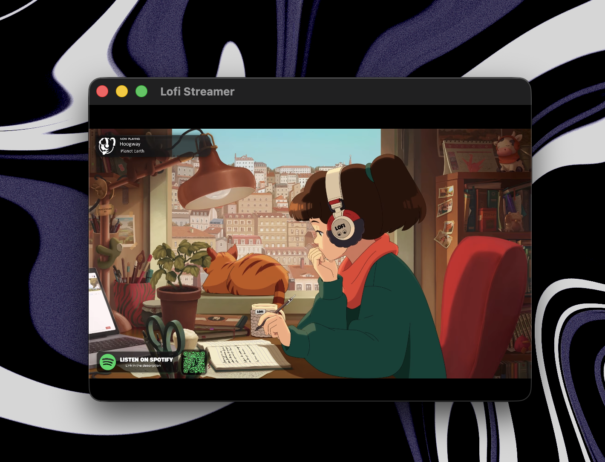

<p align="center">
  
</p>

<h1 align="center">Lofi Streamer</h1>

<p align="center">
  A tiny native macOS app that streams <a href="https://www.youtube.com/watch?v=jfKfPfyJRdk">lofi hip hop radio</a> in a minimal, borderless window.
</p>

<p align="center">
  <a href="https://github.com/FujiwaraChoki/lofi-streamer/releases/latest"></a>
  <a href="https://github.com/FujiwaraChoki/lofi-streamer/releases/latest"></a>
  
  
  <a href="https://github.com/FujiwaraChoki/lofi-streamer/blob/main/LICENSE"></a>
</p>

---

## About

**Lofi Streamer** is a lightweight, native macOS menubar-style app built with Swift and WebKit. It opens a single window streaming the iconic [lofi hip hop radio - beats to relax/study to](https://www.youtube.com/watch?v=jfKfPfyJRdk) live stream. No Electron, no bloat — just vibes.

## Features

- Native macOS app (Swift + WebKit)
- Transparent titlebar for a clean look
- Autoplay on launch
- Minimal footprint (~2 MB)
- External links open in your default browser

## Install

### Download DMG

Grab the latest `.dmg` from [**Releases**](https://github.com/FujiwaraChoki/lofi-streamer/releases/latest), open it, and drag **Lofi Streamer** into your Applications folder.

### Build from Source

```bash
git clone https://github.com/FujiwaraChoki/lofi-streamer.git
cd lofi-streamer
./run.sh
```

Requires Xcode Command Line Tools and macOS 13+ on Apple Silicon.

## License

[MIT](LICENSE)
